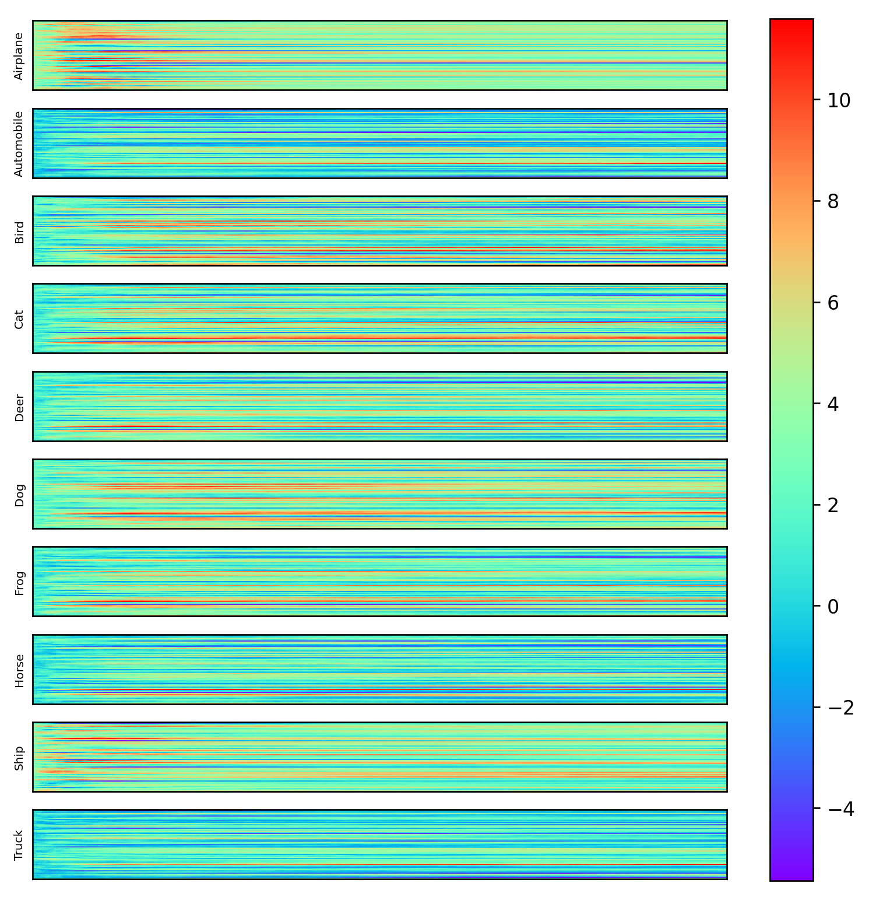
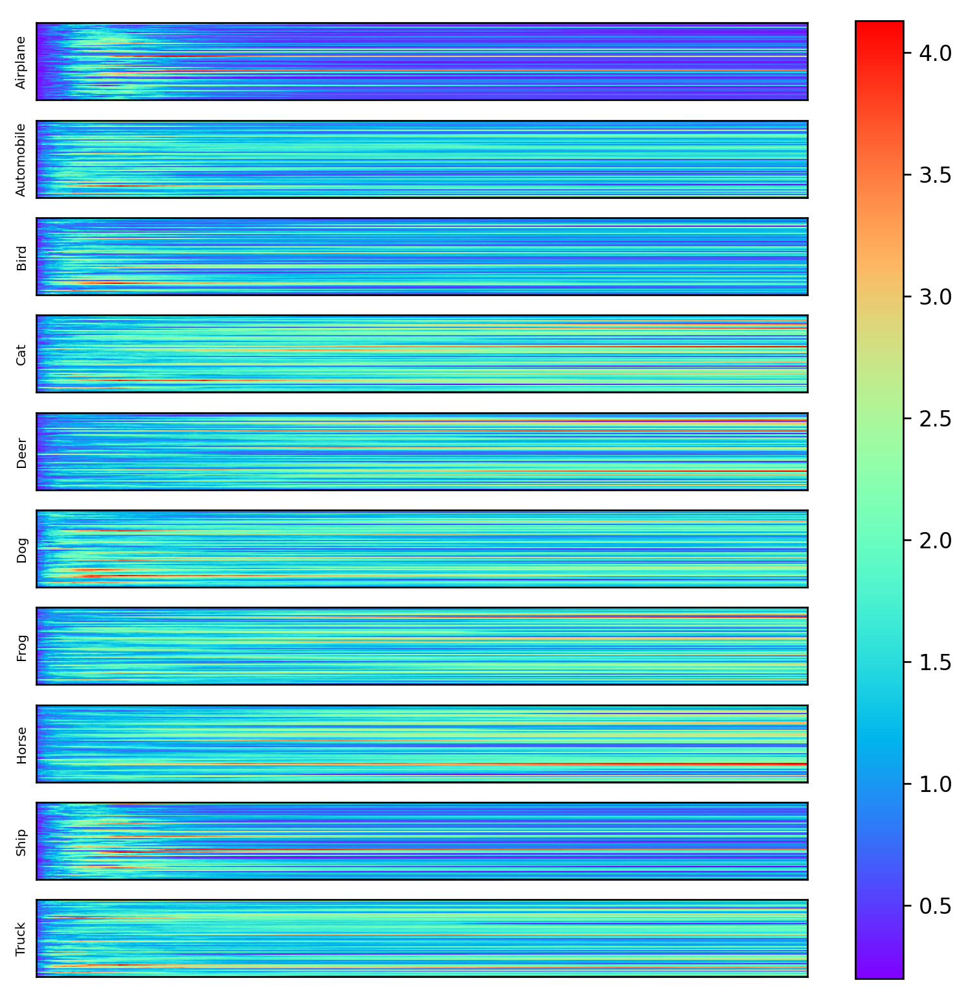
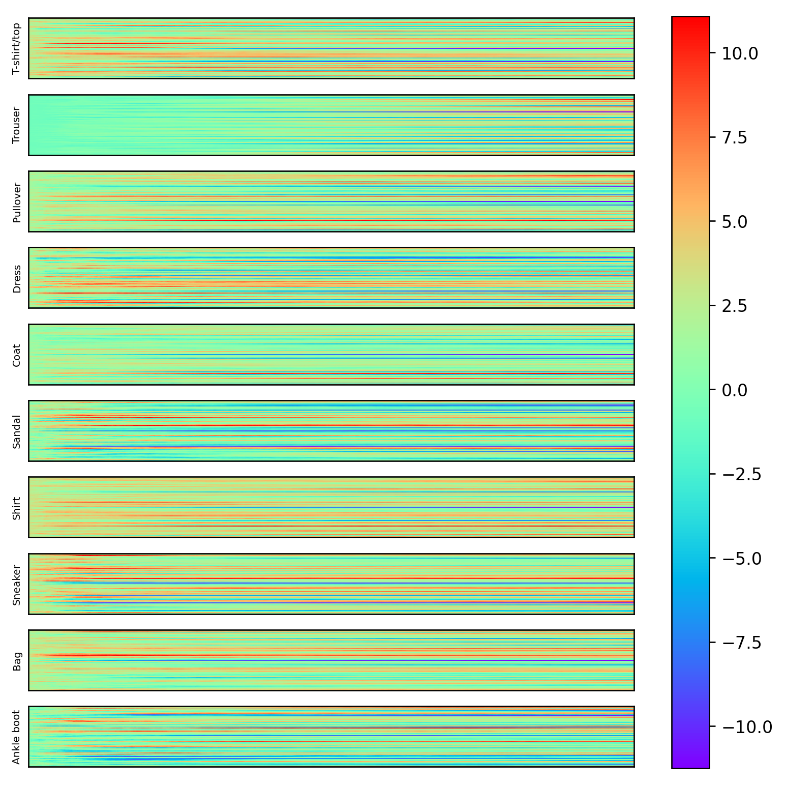
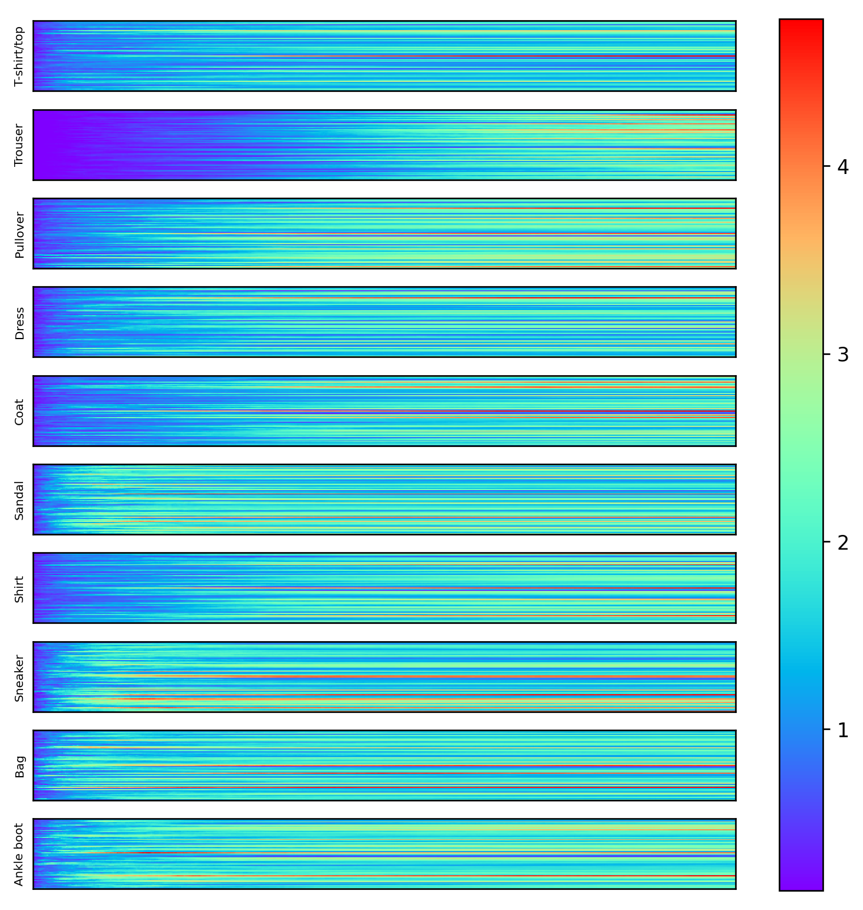
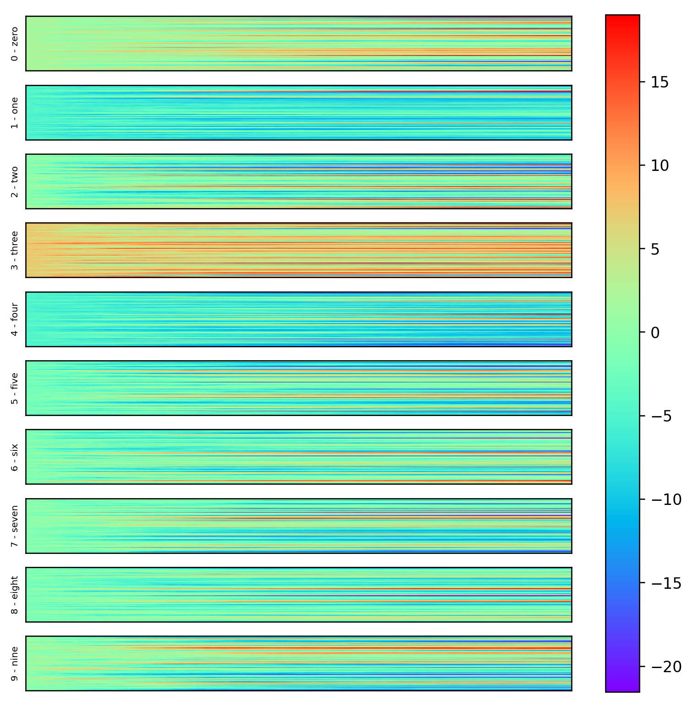
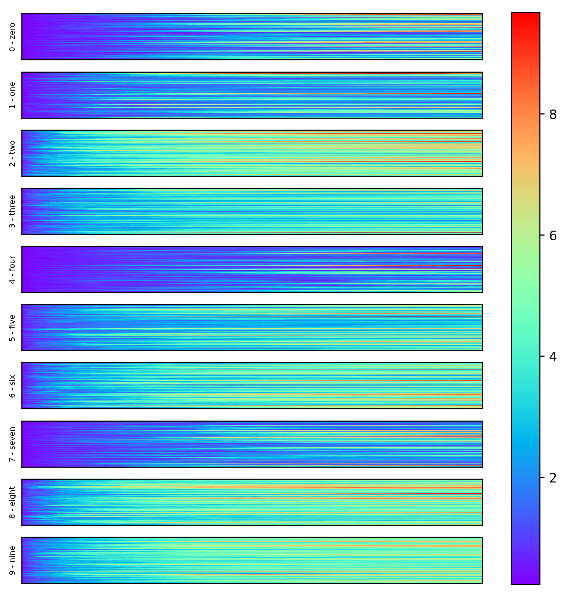

# Neuron Activation Pattern

Visualization of the neuron activation pattern for each class in a dataset. A ResNet-like fully 
connected neural network is used to create deep architectures. The output activations of each 
residual block are used for the visualization. Only correctly classified images are used to create
the activation patterns.

## Results

Below are a few results for three different data sets. The results show mean and standard deviation 
of activations for each class of the test dataset. All networks consisted of 512 residual blocks 
with a width of 64 neurons.

The blocks are plotted on the x-axis and the neurons on the y-axis.

### CIFAR10

|  |  |
|---------------------------------------------------------------------------|--------------------------------------------------------------------------|
| Mean activation per class.                                                | Standard deviation                                                       |

### Fashion-MNIST

|  |  |
|-------------------------------------------------------------------------|-------------------------------------------------------------------------|
| Mean activation per class.                                                  | Standard deviation                                                      |

### MNIST

|  |  |
|-------------------------------------------------------------------------|-------------------------------------------------------------------------|
| Mean activation per class.                                                  | Standard deviation                                                      |
