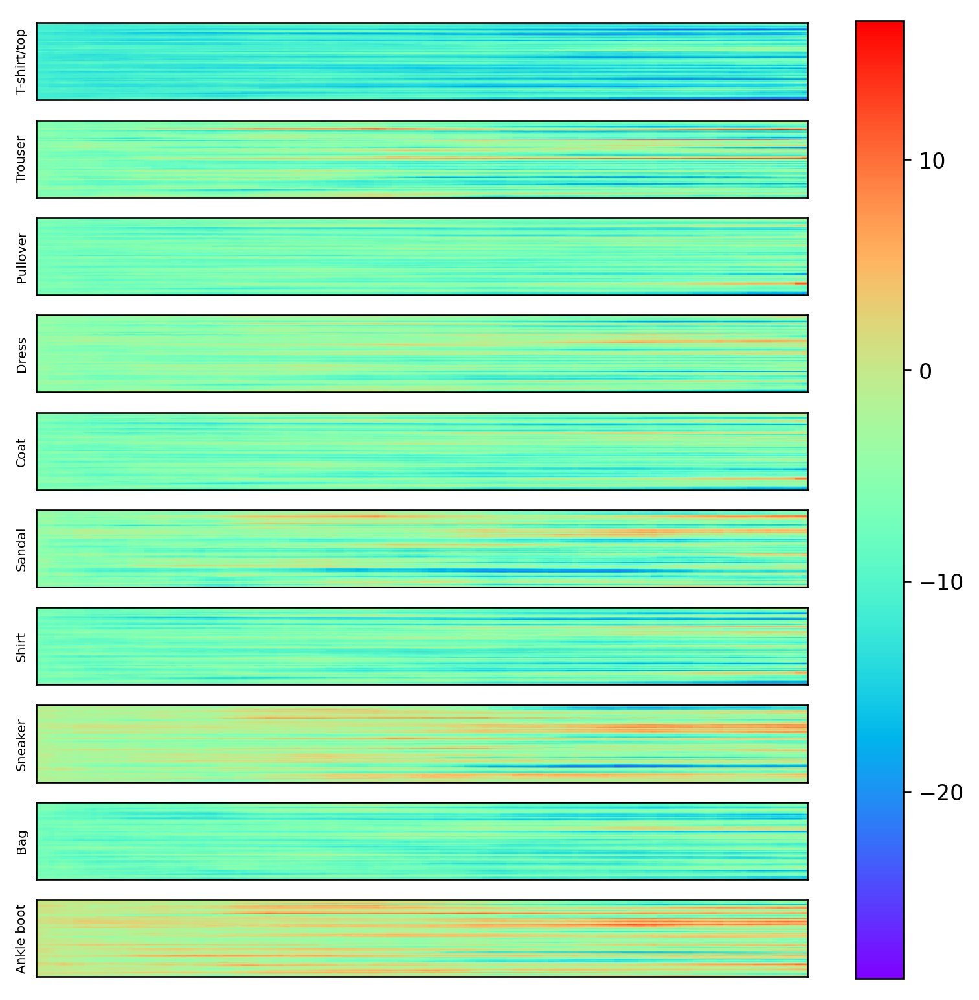
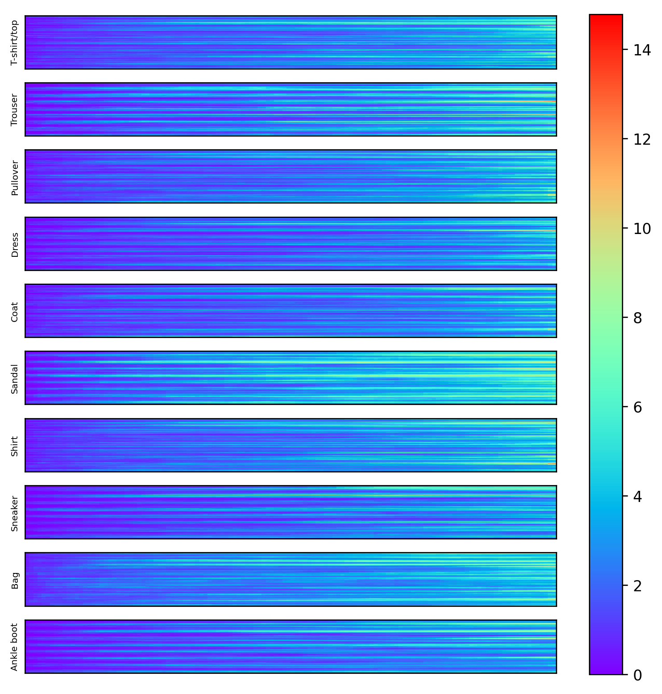

# Neuron Activation Pattern

Visualization of the neuron activation pattern for each class in a dataset. A ResNet-like fully 
connected neural network is used to create deep architectures. The output activations of each 
residual block are used for the visualization. Only correctly classified images are used to create
the activation patterns.

## Results

This section presents a few results for multilayer perceptrons (MLP) and convolutional neural 
networks (CNN). At the core, both network architecture were chosen to be isotropic to simplify 
visualization the activation patterns.

The fully connected neural networks consisted of 512 residual blocks with a width of 64 neurons. The
convolutional neural network consisted of 128 residual blocks with feature maps of size 8 x 16 x 16
(CIFAR10) and 8 x 14 x 14 (Fashion-MNIST, MNIST) resulting in 2048 and 1568 neurons per layer, 
respectively.

Below are the results for three different data sets. The results show mean and standard deviation 
of activations for each class of the test dataset. 

The blocks are plotted on the x-axis and the neurons on the y-axis.

### CIFAR10

#### MLP

|  |  |
|-------------------------------------------------------------------------------|------------------------------------------------------------------------------|
| Mean activation per class.                                                    | Standard deviation                                                           |

#### CNN

|  |  |
|-----------------------------------------------------------------------------------|----------------------------------------------------------------------------------|
| Mean activation per class.                                                        | Standard deviation                                                               |

### Fashion-MNIST

#### MLP

|  |  |
|------------------------------------------------------------------------------|-----------------------------------------------------------------------------|
| Mean activation per class.                                                   | Standard deviation                                                          |

#### CNN

|  |  |
|------------------------------------------------------------------------------|-----------------------------------------------------------------------------|
| Mean activation per class.                                                   | Standard deviation                                                          |

### MNIST

#### MLP

|  |  |
|-----------------------------------------------------------------------------|----------------------------------------------------------------------------|
| Mean activation per class.                                                  | Standard deviation                                                         |

#### CNN

|  |  |
|---------------------------------------------------------------------------------|--------------------------------------------------------------------------------|
| Mean activation per class.                                                      | Standard deviation                                                             |
